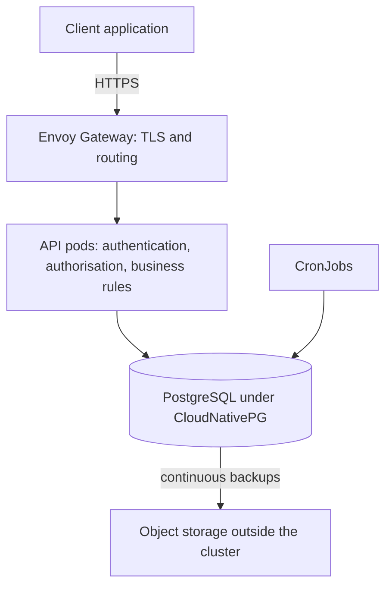

# Work-order tracker

A backend API for a facility-maintenance company. Supervisors assign repair jobs, called work orders, to technicians and track each job to completion against its due date.

## Current state

The code base is a FastAPI application with user registration, login and per-user task lists. It is the starting point for the work-order tracker. The design and the plan are complete; work-order features are built release by release through the delivery lifecycle below.

## Delivery lifecycle

| Phase | Status | Documents |
|---|---|---|
| 1. Discovery | Complete | [Engagement brief](docs/discovery/engagement-brief.md), [Data inventory](docs/governance/data-inventory.md) |
| 2. Problem statement | Complete | [Problem statement](docs/problem/problem-statement.md) |
| 3. Requirements | Complete | [Requirements](docs/requirements/requirements.md) |
| 4. System design | Complete | [Architecture](docs/design/architecture.md), [Data model](docs/design/data-model.md), [ADRs](docs/adr/), [DPIA](docs/governance/dpia.md) |
| 5. Project plan | In progress | |
| 6. Build | Not started | |
| 7. Testing and evaluation | Not started | |
| 8. Deployment | Not started | |
| 9. Monitoring and operations | Not started | |
| 10. Handover and retrospective | Not started | |

The engagement follows these ten phases in order. Each phase ends with an exit gate: a set of conditions that must be met before the next phase starts. The documents each phase produces are added to this repository once approved.

## Discovery summary

This project is presented as a POC and an MVP Implementation; the client's figures are estimates (changes occurs, all details about the client are anonymized).

The client is a facility-maintenance company in Lagos with about 100 staff, including 80 technicians. It maintains 120 buildings for 30 customer organisations and handles about 1,000 work orders a week (estimate). Customers pay a monthly fee per building that covers planned maintenance and a set number of breakdown call-outs, with service level agreement (SLA) response and resolution times. A missed SLA costs a service credit; extra call-outs and parts are billed separately.

Today, requests arrive by phone, email and WhatsApp, jobs are tracked in spreadsheets and on paper job cards, and completion is reported by phone. Discovery recorded four pain points:

| Pain point | Impact (estimate) |
|---|---|
| Service credits for missed or unprovable SLAs | About ₦8,700,000 a month |
| Billable extras never billed | About ₦2,600,000 a month |
| Planned maintenance visits skipped | About 48 a week |
| Staff time spent chasing and re-typing | About 128 hours a week |

All four share one cause: there is no single, trusted, time-stamped record of each job. The full analysis, including the current process step by step and how each figure is calculated, is in the [engagement brief](docs/discovery/engagement-brief.md).

## Data protection and governance

- **Governance tier 1:** the system holds personal data and contains no artificial intelligence (AI).
- **Personal data:** staff names, work contact details, roles and job history; customer facility managers' work contact details. No special-category data, such as health information, is collected.
- **Location:** the system records job arrival and completion times at buildings. It does not track technicians' live location.
- **Reporting:** SLA performance is reported by customer, trade and team, not as a ranking of individual technicians.
- **Law:** the Nigeria Data Protection Act 2023 (NDPA) applies. The system is also designed to meet the EU General Data Protection Regulation (GDPR).
- **Impact assessment:** a data protection impact assessment found two high risks to technicians, both reduced to low by the design's safeguards.
- **Past records:** job history from the existing spreadsheets and paper job cards is not imported.

Every dataset, its owner, retention period and each use of personal data are listed in the [data inventory](docs/governance/data-inventory.md); the assessment is in the [DPIA](docs/governance/dpia.md).

## Problem statement

Breakdowns are recorded as missing their SLA times, costing the client about ₦8,700,000 a month in service credits (estimate). Because requests, progress and completion are recorded by hand and by phone, the client can neither trust its own compliance figure nor prove that a job was on time when a customer disputes it.

| Target | Measure | Goal |
|---|---|---|
| T1 | Breakdowns with recorded reported, arrival and completion times | 98% or more within 8 weeks of go-live |
| T1a | Spot-checked breakdowns whose recorded times are confirmed | 95% or more within 8 weeks of go-live |
| T2 | Breakdowns finished within their resolution SLA, four-week average | At least 2 percentage points above the trusted baseline, by week 16 |
| T3 | Service credits paid per month | At least 25% lower, by week 16 |
| T4 | Parts recorded on jobs, as a share of parts issued from stores | 95% or more within 8 weeks of go-live |
| T5 | Planned maintenance visits completed within 3 working days of their due date | 97% or more within 12 weeks of go-live |

T1 and T1a come first because every other measure depends on complete and truthful records. The headline, T2, is set against a baseline measured in the first four weeks of use, because today's 80% figure comes from a manual report whose errors push it in both directions.

**Is AI the right tool?** No. Automatic timestamps, SLA due times calculated from contract terms, deadline warnings and fixed reports solve the problem, and each rule can be explained to a technician or a customer in a dispute. Automatic job assignment, breakdown prediction and automatic urgency classification were considered and not chosen.

The full statement, including the people who could be harmed if the system fails, is in the [problem statement](docs/problem/problem-statement.md).

## System design

The system is a backend API that staff use through a separately built client application. It runs on Kubernetes as two services, a FastAPI application and a PostgreSQL database, with scheduled tasks run from the same container image.



Requests enter through Envoy Gateway, which holds the TLS certificate. Each API pod authenticates the caller with a revocable access token, checks role, scope and job state through one policy module, and writes every job change together with its history in one database transaction. Network policies allow only the connections shown. Changes reach the cluster through GitHub Actions and Flux, and secrets are stored encrypted with SOPS.

Sixteen Architecture Decision Records explain each choice and the alternatives considered. The full design, with a text version of every diagram, is in the [architecture overview](docs/design/architecture.md).

## Technology

| Part | Current code base | Target design |
|---|---|---|
| Language | Python 3.11 | Python 3.11 |
| Web framework | FastAPI | FastAPI, JSON API only |
| Database access | SQLAlchemy, an object-relational mapper (ORM) | SQLAlchemy |
| Database | SQLite, a single-file database | PostgreSQL ([ADR 0002](docs/adr/0002-postgresql-database.md)) |
| Database migrations | Alembic | Alembic, run once per release ([ADR 0011](docs/adr/0011-scheduled-tasks-and-migrations.md)) |
| Login | JSON Web Tokens (JWT), passwords hashed with bcrypt | Stored access tokens, passwords hashed with Argon2id ([ADR 0004](docs/adr/0004-authentication-with-stored-access-tokens.md)) |
| Pages | Jinja2 templates with Bootstrap 4.3.1 | None; a separate client application uses the API |
| Tests | pytest | pytest, with property-based tests for the SLA clock |

The table shows the tools in the current code base and the tools the design replaces them with. Each change is explained in the linked Architecture Decision Record.

## Running locally

These steps run the current code base.

Requirements: git, uv (a Python package and environment manager) and a Linux or macOS shell. On Windows, use WSL (Windows Subsystem for Linux).

1. Clone the repository.
   ```bash
   git clone https://github.com/OSegun/work-order-tracker.git
   cd work-order-tracker
   ```
2. Create a virtual environment with Python 3.11 and install the dependencies.
   ```bash
   uv venv --python 3.11 .venv
   uv pip install --python .venv/bin/python -r requirements.txt
   ```
3. Create a `.env` file containing a random signing key. `.env.example` lists every setting the application reads.
   ```bash
   python3 -c "import secrets; print('SECRET_KEY=' + secrets.token_hex(32))" > .env
   ```
4. Load the settings into the current shell. Repeat this step in every new shell.
   ```bash
   set -a; source .env; set +a
   ```
5. Start the application.
   ```bash
   .venv/bin/uvicorn main:app --reload
   ```
6. Open http://127.0.0.1:8000. On first start, the application creates the SQLite database file `todoApplication.db` in the project folder.

## Running the tests

With the settings loaded (step 4 above):

```bash
.venv/bin/python -m pytest
```

The tests store their data in a separate database file, `testdb.db`.
