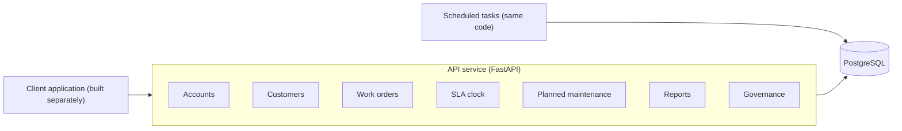
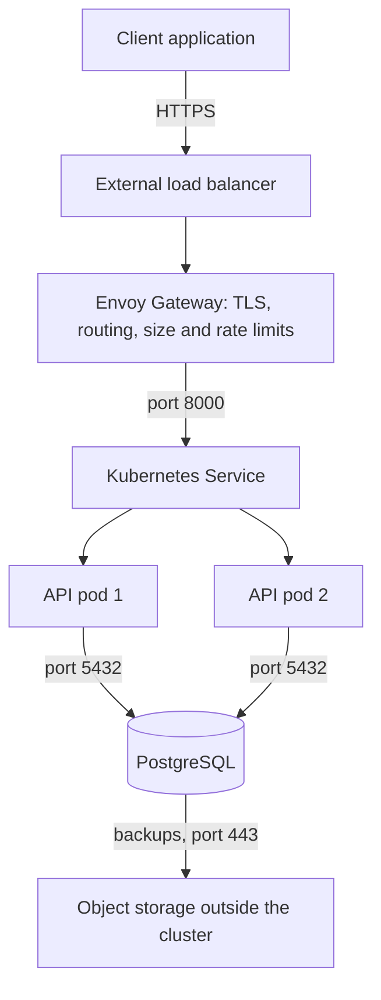
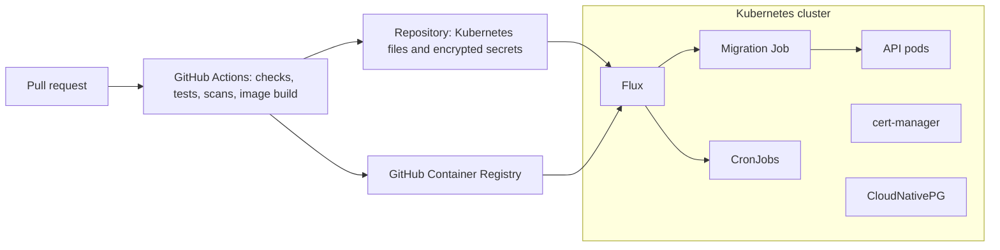

# Architecture overview

The work-order tracker is a backend application programming interface (API) that records repair and maintenance jobs, calculates service level agreement (SLA) due times, enforces who may do what, and reports on-time performance. Staff use it through a separately built client application. The backend runs on Kubernetes as two services, the API and a PostgreSQL database, with scheduled tasks run from the API's container image. This document describes the system in three views and links to the decisions behind it.

## View 1: what the software is made of



<details>
<summary>Text version of the diagram</summary>

```
 Client application (built separately)
            |
            v
 +---------------------------------------------+
 | API service (FastAPI)                       |
 |  Accounts | Customers | Work orders         |
 |  SLA clock | Planned maintenance            |
 |  Reports | Governance                       |
 +----------------------+----------------------+
                        |
 Scheduled tasks -------+------> PostgreSQL
 (same code)
```

</details>

| Module | Responsibility | Main requirements |
|---|---|---|
| Accounts | Logins, access tokens, roles, passwords, deactivation, privacy notice acknowledgement | FR-1, FR-24, FR-25, GR-1, NFR-9, NFR-10 |
| Customers | Customers, buildings, contacts, contract and SLA terms, one-time import | FR-2, FR-20 |
| Work orders | Logging, assignment, lifecycle, holds, parts, corrections, verification, spot checks, history | FR-3 to FR-12, FR-18, FR-21 to FR-23, FR-28, FR-29 |
| SLA clock | Due times from contract terms and the working calendar | FR-5, FR-26, NFR-8 |
| Planned maintenance | Maintenance schedules and the creation of planned work orders | FR-14 |
| Reports | Deadline list, SLA, completeness, billable-extras and planned maintenance reports | FR-13, FR-15 to FR-17, FR-19, FR-27 |
| Governance | Finding, exporting, correcting, restricting and deleting one person's data; retention | GR-2, GR-3 |

Only the work-orders module changes a job's status, and only through the SLA clock does any module calculate a due time. The reports module only reads data. The full mapping of requirements to modules is in [traceability](traceability.md).

## View 2: how a request travels



<details>
<summary>Text version of the diagram</summary>

```
 Client application
        | HTTPS
        v
 External load balancer
        |
        v
 Envoy Gateway (TLS certificate, routing, size and rate limits)
        | port 8000
        v
 Kubernetes Service (spreads requests across ready pods)
        |                 |
        v                 v
   API pod 1          API pod 2
   (authentication, authorisation, validation, module logic)
        |                 |
        +-------+---------+
                | port 5432
                v
          PostgreSQL ------> object storage outside the cluster (backups)
```

</details>

1. The client application connects over encrypted HTTPS to the external load balancer, the system's only public address.
2. Envoy Gateway ends the encrypted connection with a certificate managed by cert-manager, routes API requests, and limits request size and rate per address (ADR 0006).
3. The Kubernetes Service spreads requests across API pods that report themselves ready (ADR 0012).
4. In each pod, every request is authenticated with a stored access token (ADR 0004), then authorised by role, scope and state through one policy module (ADR 0005), then validated and handled. Changes use version checks and idempotency keys (ADR 0010) and write history in the same transaction (ADR 0015).
5. Default-deny network policies allow only the connections shown; the API cannot reach the internet (ADR 0008).
6. PostgreSQL, run by CloudNativePG, backs up continuously to object storage outside the cluster (ADR 0003).

## View 3: the platform around the system



<details>
<summary>Text version of the diagram</summary>

```
 Pull request --> GitHub Actions (checks, tests, scans, image build)
                        |                       |
                        v                       v
         GitHub Container Registry     Repository (Kubernetes files,
                        |              SOPS-encrypted secrets)
                        |                       |
 +----------------------v-----------------------v-------------+
 | Kubernetes cluster                                         |
 |   Flux --> Migration Job --> API pods                      |
 |   Flux --> CronJobs (planned jobs, spot checks, retention, |
 |            clean-up)                                       |
 |   cert-manager (certificates)   CloudNativePG (database)   |
 |   Logs to standard output; metrics on an internal port     |
 +------------------------------------------------------------+
```

</details>

- Every pull request runs formatting, linting, type checks, tests against PostgreSQL, secret, dependency and image scans, and an OpenAPI check. A merge to main publishes an image tagged with its commit identifier (ADR 0013).
- Flux, inside the cluster, applies the state held in the repository, decrypts SOPS-encrypted secrets (ADR 0016), runs the migration Job and then updates the API pods (ADR 0011).
- Four CronJobs run on Africa/Lagos time: planned work orders, weekly spot checks, retention, and removal of expired records (ADR 0011).
- The API writes JSON logs to standard output and exposes metrics on an internal port; liveness and readiness are checked separately (ADR 0012).

## Environments

| Environment | Hosting | Data |
|---|---|---|
| Local | kind with Calico on the development machine | Synthetic |
| Pilot | One Oracle Cloud Always Free virtual machine running k3s, Johannesburg | Synthetic |
| Production | A multi-node cluster, recommended and costed during deployment | Real |

The local and pilot environments cost nothing. Production hosting is decided during deployment, including whether data stays in Nigeria (ADR 0014).

## Decisions

| ADR | Decision |
|---|---|
| [0001](../adr/0001-backend-api-on-kubernetes.md) | Backend API as one service on Kubernetes |
| [0002](../adr/0002-postgresql-database.md) | PostgreSQL as the database |
| [0003](../adr/0003-postgresql-on-kubernetes-with-cloudnativepg.md) | PostgreSQL on Kubernetes with CloudNativePG |
| [0004](../adr/0004-authentication-with-stored-access-tokens.md) | Authentication with stored access tokens and Argon2id passwords |
| [0005](../adr/0005-authorisation-policy-module.md) | Authorisation through one policy module |
| [0006](../adr/0006-gateway-api-entry-point.md) | Gateway API as the entry point, with cert-manager |
| [0007](../adr/0007-secrets-and-configuration.md) | Secrets and configuration (superseded by 0016) |
| [0008](../adr/0008-network-policies.md) | Default-deny network policies |
| [0009](../adr/0009-sla-clock-module.md) | SLA clock as a pure, stored-result module |
| [0010](../adr/0010-version-checks-and-idempotency-keys.md) | Version checks and idempotency keys |
| [0011](../adr/0011-scheduled-tasks-and-migrations.md) | Scheduled tasks as CronJobs and migrations as a single Job |
| [0012](../adr/0012-observability.md) | Structured logs, Prometheus metrics and separate health checks |
| [0013](../adr/0013-ci-cd-with-github-actions-and-flux.md) | CI with GitHub Actions and GitOps delivery with Flux |
| [0014](../adr/0014-hosting-region-and-cost.md) | Hosting, region and cost |
| [0015](../adr/0015-append-only-history-and-audit-log.md) | Append-only job history and audit log |
| [0016](../adr/0016-secrets-with-sops-and-flux.md) | Secrets encrypted with SOPS and decrypted by Flux |

## Related documents

- [Data model](data-model.md)
- [Access control](access-control.md)
- [Traceability](traceability.md)
- [Design risks](design-risks.md)
- [Data protection impact assessment](../governance/dpia.md)
