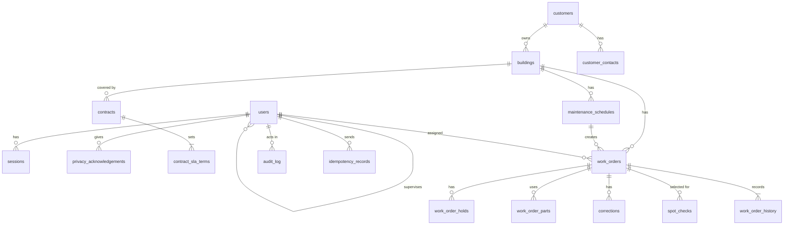

# Data model

This document lists the tables in the PostgreSQL database (ADR 0002), their main columns and how they relate. It implements the [requirements](../requirements/requirements.md) and the decisions in `docs/adr/`. Every dataset here appears in the [data inventory](../governance/data-inventory.md).

## Conventions

- Every table has a numeric `id` primary key unless stated otherwise.
- Times are stored as "timestamp with time zone" in Coordinated Universal Time (UTC) (NFR-8).
- Money is stored as whole kobo (1 naira = 100 kobo) in integer columns, so that totals are exact.
- Urgency levels are `urgent` (measured in clock hours), `high` and `routine` (measured in working hours). The hours for each level are set per contract.

## Diagram

The diagram shows five groups: accounts and access (`users`, `sessions`, `privacy_acknowledgements`), customers and contracts, work orders and their related records, planned maintenance, and operations. A technician's `supervisor_id` points to another row in `users`, which defines each supervisor's team.

## Tables

### Accounts and access

| Table | Main columns | Requirements and decisions |
|---|---|---|
| `users` | username (unique), full name, work email (unique), phone, role, trade (technicians only), supervisor_id (technicians only), is_active, must_change_password, created_at, deactivated_at, pseudonymised_at | FR-1, FR-24, FR-25, GR-3 |
| `sessions` | user_id, token_hash (unique), issued_at, expires_at, revoked_at | ADR 0004, FR-25 |
| `failed_logins` | username attempted, IP address, occurred_at | ADR 0004, NFR-9 |
| `privacy_acknowledgements` | user_id, notice version, acknowledged_at | GR-1 |

### Customers and contracts

| Table | Main columns | Requirements and decisions |
|---|---|---|
| `customers` | name, is_active | FR-2 |
| `buildings` | customer_id, name, area of Lagos, building type | FR-2 |
| `customer_contacts` | customer_id, name, work phone, work email, is_active, replaced_at | FR-2, GR-3 |
| `contracts` | building_id, starts_on, ends_on, monthly fee (kobo), included breakdown call-outs per month, service credit per missed SLA (kobo) | FR-2, FR-9 |
| `contract_sla_terms` | contract_id and urgency (together unique), response time in minutes, resolution time in minutes | FR-2, FR-5 |

### Working calendar

| Table | Main columns | Requirements and decisions |
|---|---|---|
| `holidays` | date (primary key), name | FR-26, ADR 0009 |
| `calendar_settings` | one row: opening time, closing time, working days | FR-26, ADR 0009 |

### Work orders

| Table | Main columns | Requirements and decisions |
|---|---|---|
| `work_orders` | building_id, trade, urgency, kind (breakdown or planned), status, fault description, reporting channel, reported_at, logged_at, logged_by, assigned_technician_id, response_due_at, resolution_due_at, arrived_at, arrived_phone_at, completed_at, completed_phone_at, verified_by, verified_at, cancellation reason, notes, is_billable, is_out_of_scope, maintenance_schedule_id, planned_due_on, version | FR-3 to FR-10, FR-14, FR-18, FR-23, ADR 0009, ADR 0010 |
| `work_order_holds` | work_order_id, reason, is_customer_caused, started_at, ended_at, confirmed_by, confirmed_at | FR-5, FR-8, FR-29 |
| `work_order_parts` | work_order_id, description, quantity, unit cost (kobo) | FR-9, FR-16, T4 |
| `corrections` | work_order_id, field, old value, new value, reason, requested_by, requested_at, approved_by, approved_at, status | FR-11 |
| `spot_checks` | work_order_id, week_start, selected_at, checked_by, result, checked_at | FR-28 |
| `work_order_history` | work_order_id and sequence (together unique), occurred_at, phone time, actor_id, actor role, action, changes (before and after), reason, request_id | FR-12, ADR 0015 |

`maintenance_schedule_id` and `planned_due_on` are unique together, so a planned visit cannot be created twice (ADR 0011).

### Planned maintenance

| Table | Main columns | Requirements and decisions |
|---|---|---|
| `maintenance_schedules` | building_id, equipment, task, trade, frequency (weekly, monthly or quarterly), tolerance in working days (default 3), next_due_on, is_active | FR-14, FR-17, T5 |

### Operations

| Table | Main columns | Requirements and decisions |
|---|---|---|
| `idempotency_records` | user_id and key (together the primary key), request fingerprint, state, response status, response body, created_at | ADR 0010 |
| `audit_log` | occurred_at, actor_id, action, target type, target id, details, request_id | GR-4, ADR 0015 |
| `task_runs` | task name (primary key), last_success_at | ADR 0012 |

## Access by database role

The application role may read and insert rows in `work_order_history` and `audit_log` but not update or delete them. The retention role may update person columns in those tables for pseudonymisation and delete rows at the end of their retention period. The migration role changes table structure (ADR 0015).
